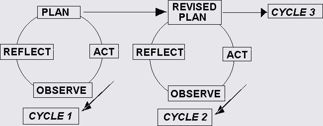

#### Information Research, Vol. 1 No. 1, April 1995

# An action research approach to curriculum development

#### Phil Riding, Sue Fowell and[Phil Levy](mailto:p.levy@shef.ac.uk)  
Department of Information Studies  
University of Sheffield, Sheffield, UK

## Computer-supported collaborative work and learning

A new research group has recently been established in the Department, focusing upon electronic support for collaborative learning and work. In the area of computer-supported collaborative learning (CSCL), we are exploring and developing new pedagogic models for learning, using electronic support and learner-centred approaches. For example, our current activities involve the exploitation of appropriate technology to support open and distance learning, and the design of curricula based upon constructivist and experiential learning principles ([Duffy & Jonassen, 1992](#duffyt);[Kolb, 1984](#kolbd)). The research group supports departmental teaching and learning innovations as well as pursuing its wider research agenda. In the area of computer-supported collaborative work (CSCW), we are interested in the changing contexts for collaborative work offered by new technologies, from both managerial and social-psychological perspectives. The British Library has recently awarded the group a grant to undertake a sixteen-month project entitled Communicating Effectively in the Networked Library.

## Action research

Action research into our own teaching practice is an important source of learning for the group. Here, we describe the nature of action research, and describe its use in the on-going development and evaluation of a new undergraduate module. We hope to show that an action research approach to teaching can be used to improve teaching and learning practice.

Action research has been used in many areas where an understanding of complex social situations has been sought in order to improve the quality of life. Among these are industrial, health and community work settings. Kurt Lewin, often cited as the originator of action research ([McKernan, 1991](#mckernanj)), used the methodology in his work with people affected by post-war social problems. Action research approaches to educational research were adopted in the late 60s and early 70s by the 'teacher- researcher' movement in the secondary education sector. This sought to bring the practising classroom teacher into the research process as the most effective person to identify problems and to find solutions.

We believe that an action research approach can contribute very positively to activity within the tertiary sector concerned with teaching quality issues, and with national Teaching Quality Assessment initiatives. As "reflective practitioners" ([Schon,1983](#schond)), we can achieve greater ownership of the evaluative process by becoming systematically self-assessing, alongside, and feeding into, external assessment processes:

> "Through systematic, controlled action research, higher education teachers can become more professional, more interested in pedagogical aspects of higher education and more motivated to integrate their research and teaching interests in a holistic way. This, in turn, can lead to greater job satisfaction, better academic programmes, improvement of student learning and practitioner's insights and contributions to the advancement of knowledge in higher education."
> 
> <address>(Zuber-Skerritt, 1982: 15)</address>

Despite progress in understanding of the way in which people learn and the design of learning environments, teaching practice in higher education often remains unaffected. Traditionally, lecturers have not been encouraged to draw upon theoretical developments as a means of improving curriculum design and delivery. However, more recently, a number of initiatives at national and local levels have been established to create the conditions for innovation in these activities, and teaching/learning is becoming recognised as a more valid area of enquiry for academics across all disciplines, rather than as the unique preserve of specialists.

Action research methodology offers a systematic approach to introducing innovations in teaching and learning. It seeks to do this by putting the teacher in the dual role of producer of educational theory, and user of that theory. This is both a way of producing knowledge about higher education learning and teaching, and a powerful way of improving learning and teaching practice. No separation need be made between the design and delivery of teaching, and the process of researching these activities, thereby bringing theory and practice closer together.

A variety of forms of action research have evolved ([Carr & Kemmis, 1986](#carrw)) . All adopt a methodical, iterative approach embracing problem identification, action planning, implementation, evaluation, and reflection. The insights gained from the initial cycle feed into planning of the second cycle, for which the action plan is modified and the research process repeated (Figure 1).

[Kolb (1984)](#kolbd)extended this model to offer a conception of the action research cycle as a learning process, whereby people learn and create knowledge by critically reflecting upon their own actions and experiences, forming abstract concepts, and testing the implications of these concepts in new situations. Practitioners can create their own knowledge and understanding of a situation and act upon it, thereby improving practice and advancing knowledge in the field.

Action research has a number of further distinctive features, as described by[Zuber-Skerritt, (1982)](#zubers). For her, action research is:

*   _Critical_collaborative enquiry by
*   _Reflective_practitioners who are
*   _Accountable_in making the results of their enquiry public,
*   _Self-evaluative_in their practice, and engaged in
*   _Participative_problem-solving and continuing professional development.

According to this view, action research is critical in the sense that practitioners not only look for ways to improve their practice within the various constraints of the situation in which they are working, but are also critical change agents of those constraints, and of themselves. It is reflective in that participants analyse and develop concepts and theories about their experiences. Action researchers are accountable in that they aim to make their learning process and its results public, both to each other and to other interested practitioners, using accessible terminology. Their practice is self-evaluated in that the reflective and analytical insights of the researcher- practitioners themselves form the basis of the developmental process. Action research is participative in that those involved contribute equally to the inquiry, and collaborative in that the researcher is not an expert doing research from an external perspective, but a partner working with and for those affected by the problem and the way in which it is tackled.

## Curriculum Development

We have decided to take a group-based action research approach to the development of an introductory undergraduate module on the use of computer-mediated communications, entitled Elements of Information Management: communicating effectively in the networked organisation. This activity has been supported by funding from Sheffield University Curriculum Development Fund, enabling one of us to devote time to formalising a suitable action research approach. We hope to develop a model based upon our experience which will be transferable to other curriculum development initiatives.

Our curriculum design seeks to address two major objectives in undergraduate education: firstly, to enable students to experience "deep" learning; and secondly, to facilitate the development of transferable skills. It has long been recognised that traditional teaching techniques often fail to encourage "deep" learning of subject content, which goes beyond short-term rote memorisation to enable the assimilation of new knowledge in a way which allows re-application to novel situations ([Entwhistle, 1988](#entwhistlen)). Strategies to develop transferable skills in areas such as thinking and learning, self-management, communication, group work and information management, are intended to prepare students for work outside of the academic contexts in which they are learned initially.

The teaching strategy we have decided upon uses experiential and constructivist learning principles ([Duffy & Jonassen, 1992](#duffyt);[Kolb,1984](#kolbd);[Boud, et al., 1985](#boudd)). For much of the module, students are engaged in a group-based collaborative project supported by the use of computer-mediated communication technologies such as electronic mail, asynchronous conferencing and synchronous chat. This is complemented by a range of individually-based learning activities. Students are provided with a range of on-line information resources, and have access to tutor support via electronic mail and face-to-face meetings as necessary. A major issue for us as action researchers is to come to an understanding of the nature and level of support required by students to gain the most from their learning activities. A key question associated with this is: what is the necessary balance between externally-imposed structure and control and the students freedom to be self-directed?

A number of features of the way we have decided to work on this module mark the approach as being one of action research:

_We aim to apply the model offered by the action research cycle._

Although not yet complete, the development of the module is following the action research cycle illustrated earlier. By completion of the first cycle, we will have:

*   identified a number of objectives and formed initial working hypotheses about meeting them. For instance, a key objective is to provide an appropriate framework for deep learning, for which we believe it will be necessary to encourage maximum student ownership of the learning process;
*   planned a curriculum model and devised materials and processes to support it. For instance, a key feature of our curriculum model is students' engagement in collaborative group project work. Materials and processes to support this include process workbooks and learning diaries for individual work, process workshops to support positive group functioning, and on-line tutor support.
*   put these into practice by running the module. The module is based upon one hour of theory workshop and two hours of project work per week, over one semester. The main form of assessment is by coursework (the group project), supplemented by individually-produced learning diaries.
*   made observations on our practice and evaluated its effects. Evaluation and self-assessment strategies include a range of on-going student feedback mechanisms and tutor debriefings.
*   reflected upon the results of the evaluation, in preparation for modifying our practice for the second implementation of the module. For instance, at present the choice of focus for student project work is relatively limited. Given that students participating in the module come from a very wide diversity of academic disciplines, which are likely to hold distinctive perspectives on computer-mediated communication, we would like to open this up to greater student choice in future if appropriate.

_We intend that the inquiry is critical in spirit and purpose._

We believe that it is useful for our own development to perceive ourselves as a "critical community" of practitioners who not only want to improve the quality of teaching and learning in higher education within the constraints and practical considerations imposed upon us, but who also seek to be change agents of those constraints. For instance, assessment by examination is traditionally imposed at University level for this type of module; we anticipate and hope that its outcomes will justify the future elimination of this form of assessment in future implementation.

_We aim to be reflective and self-evaluating._

Insights gained from reflection and analysis of our practice will be fed back into practice. There will be continuous re-assessment of the module and its structure. Built into the module are mechanisms which remind and encourage us to reflect systematically on our activities. For instance, as tutors we keep a collaborative on-line 'tutor diary' in which we share our reflections on teaching performance, content, course structure, student response, etc., relating them to prior experience and to teaching/learning theory. Individual experience is thus made available between colleagues for comment and analysis, and we attempt to challenge as well as support each other. This semi-public sharing of experience creates a collegial, collaborative approach to our personal professional development.

_We are accountable._

We intend to make public the results of our evaluation, and the process by which it was achieved, both locally and more widely.

_We are engaged in participative problem-solving._

Those doing the research and those doing the teaching are one and the same. We have not employed external evaluators to assess the module; rather, we work together to gather data during its development and implementation which will then be analysed collectively, taking account of the point of view of each of us. We believe that reporting of the project should similarly embrace all points of view, and reports will be jointly written.

## Conclusion

We do not expect to achieve a cut-and-dried solution to the objectives we have identified, and we are not concerned with producing a strictly generalisable model of learning or teaching. However, we do hope that fellow practitioners will find our experiences useful, both as an example of action research and as a curriculum model. We would welcome communication with others working in similar ways on curriculum development within the field of information studies.

## References

Boud, D. et al. (1985) Reflection: Turning Experience into Learning. London: Kogan Page.[Return to text](#boud)

Carr, W. and Kemmis, S. (1986) Becoming Critical: Education, Knowledge and Action Research. Basingstoke: Falmer Press.[Return to text](#carr)

Duffy, T.M. & Jonassen, D.J., eds. (1992) Constructivism and the Technology of Instruction: a Conversation. Hillsdale, NJ: Lawrence Erlbaum Associates.[Return to text](#duffy)

Entwhistle, N.J. (1988) Styles of Learning and Teaching: An Integrated Outline of Educational Psychology. David Fulton: London.[Return to text](#entwhistle)

Kolb, D. (1984) Experiential Learning. Experience as the Source of Learning and Development. Englewood Cliffs, New Jersey: Prentice-Hall.[Return to text (a)](#duffy)[Return to text (b)](#kolb)[Return to text (c)](#kolb2)

McKernan, J. (1991) Curriculum Action Research. London: Kogan Page.[Return to text](#mckernan)

Schon, D. (1983) The Reflective Practitioner: how Professionals Think in Action. New York: Basic Books.[Return to text](#schon)

Zuber-Skerritt, O. (1982) Action Research in Higher Education. London: Kogan.[Return to text](#zuber)